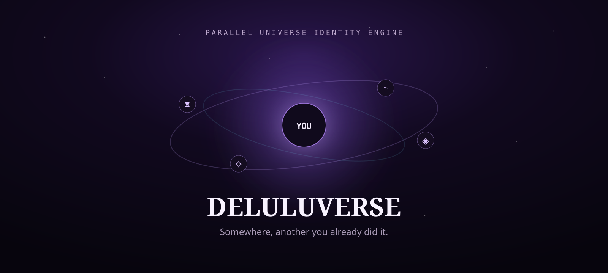

# DeluluVerse — Parallel Universe You

<p align="center">
  
</p>

<p align="center">
  <strong>Somewhere, another you already did it.</strong><br/>
  A cinematic alternate-life simulator for people whose Plan B is another universe.
</p>

<p align="center">
  <a href="https://deluluverse-nu.vercel.app"><strong>✦ Enter the live multiverse</strong></a>
  ·
  <a href="https://github.com/Rishikeshsanin/DeluluVerse/actions/workflows/validate.yml">CI</a>
</p>

---

DeluluVerse takes a few facts about your current timeline and fractures them into personalized alternate realities: founder-you, 2050-you, the career you never chose, and a restricted neon-cyberpunk version of yourself.

It is intentionally dramatic, fantasy-first, responsive, and privacy-friendly. V1 requires **no login, database, analytics service, paid AI API, or shared infrastructure**.

## ✦ What it does

- Five-step reality calibration flow
- `% DELULU` chaos control
- Personalized deterministic reality generation
- Four cinematic alternate universes
  - Founder Reality
  - 2050 Reality
  - The Path Not Taken
  - Restricted Cyberpunk Timeline
- Dynamic roles, cities, powers, relics and reality stats
- Timeline echoes for every universe
- Interactive three-decision branch experiment
- Multiple branch endings
- Re-rollable universe seed
- Copyable reality summaries
- Browser-local persistence via `localStorage`
- Responsive layouts for desktop, tablet and mobile
- Reduced-motion accessibility support
- User-input escaping before generated HTML is rendered

## Tech

- HTML5
- CSS3
- Vanilla JavaScript
- Browser `localStorage`
- Vercel static deployment
- GitHub Actions validation
- **Zero runtime package dependencies**

## Run locally

No package installation is required.

macOS / Linux:

```bash
python3 -m http.server 4173
```

Windows:

```powershell
py -m http.server 4173
```

Then open `http://localhost:4173`.

## Validate

Node.js is only used for the repository validation script; it is not required by the website at runtime.

```bash
npm run check
```

The same validation runs automatically through GitHub Actions on pushes and pull requests targeting `main`.

## Privacy & isolation

Profile answers remain in the visitor's browser. DeluluVerse v1 has no authentication, remote database, analytics SDK, or third-party AI API.

The deployment is intentionally isolated from other projects: no shared database, environment variables, storage buckets, or backend services are required.

## Deployment

Production: **https://deluluverse-nu.vercel.app**

`vercel.json` includes defensive headers for content-type sniffing, referrer behavior, and unused browser permissions.

## Roadmap

- Shareable URL-encoded universe seeds
- Optional AI narrative mode behind an isolated serverless endpoint
- Generated portrait / avatar reality cards
- Spatial 3D portal mode
- Multiplayer “compare timelines”
- Saveable multiverse collections

---

Built as a deliberately dramatic one-person internet experiment. ✦
